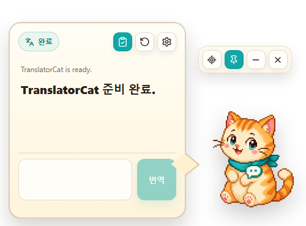

# TranslatorCat 2026

TranslatorCat 2026 is a tiny always-on-top desktop translator. A generated pixel cat floats near the right side of the screen, watches the clipboard, and shows translations in a speech bubble.



## Features

- Floating transparent Electron window with a generated pixel-art cat mascot.
- Automatic clipboard translation.
- Speech-bubble translation result with optional original text.
- Manual text input when you want to translate without touching the clipboard.
- `Ctrl+Shift+Y` global shortcut for instant clipboard translation.
- LibreTranslate-compatible endpoint setting.
- Local LibreTranslate Docker setup for self-hosted translation.

## Mascot

The cat mascot was generated with the built-in image generation tool, then processed from a chroma-key source into a transparent PNG.


Final asset:

```text
src/assets/translator-cat.png
```

Generation prompt summary:

```text
Cute 32-bit pixel art cat mascot for a desktop translation app, sitting upright, warm cream and orange fur, teal scarf accent, small speech-bubble charm, centered full-body sprite, no text, no watermark, on a flat #00ff00 chroma-key background for transparent PNG extraction.
```

## Run

```powershell
npm install
npm run dev
```

For the packaged-production renderer:

```powershell
npm run build
npm start
```

## Translation Backend

The app uses a LibreTranslate-compatible endpoint. The default endpoint is:

```text
https://libretranslate.com/translate
```

You can switch it in the app settings to a local server:

```text
http://localhost:5000/translate
```

Start a local LibreTranslate container:

```powershell
docker compose up -d
```

## Controls

- Clipboard icon: toggle automatic clipboard translation.
- Rotate icon: translate the current clipboard immediately.
- Pin icon: keep the cat above other windows.
- Locate icon: snap the window back to the right side.
- `Ctrl+Shift+Y`: translate the current clipboard.

## Build Installer

```powershell
npm run dist
```

Installer output:

```text
release/TranslatorCat 2026 Setup 0.1.0.exe
```

The installer is generated locally and ignored by Git.
